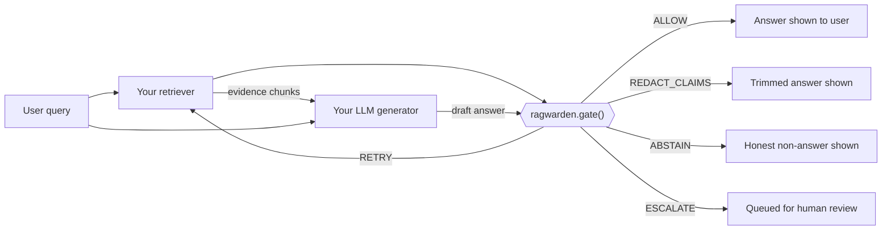

# RagWarden

> An inline hallucination gate for production RAG pipelines.

**RagWarden doesn't compete with RAGAS or UQLM — it's the runtime enforcement layer that uses
signals like theirs (and its own fast detectors) to make a bounded-latency, explainable decision
inline in production, with a policy engine enterprises can tune to their own risk tolerance.**

An answer generated by *any* RAG pipeline is broken into atomic, independently-checkable claims.
Each claim runs through a cascade of checks ordered cheapest-first:

1. **Tier 0 — retrieval heuristics** (deterministic, near-zero cost, always on)
2. **Tier 1 — claim-vs-evidence entailment** (fast encoder models: NLI, HHEM, LettuceDetect, MiniCheck)
3. **Tier 2 — uncertainty quantification** (consistency sampling; token log-probs if available)
4. **Tier 3 — LLM-as-judge** (structured chain-of-thought, budget-capped, only the ambiguous remainder)

Per-claim verdicts combine into a composite reliability score. A configurable **policy engine**
turns that score into an action — `ALLOW`, `REDACT_CLAIMS`, `RETRY`, `ABSTAIN`, or `ESCALATE` — and
every decision comes with a full explanation trail.

**`gate()` does not fail your request.** Every external dependency — a Tier-1 detector, your
`generate_fn`, your `judge_fn` — is fault-isolated and time-boxed; an unexpected failure anywhere in
the cascade degrades to a safe `ABSTAIN` instead of an unhandled exception. See
[Running in production](docs/production.md).

## Status

**v0.3.0.** Benchmark numbers below are an honest baseline, not yet competitive. On the path to a
v1.0 that locks `ragwarden.contracts` under semver. Full phase-by-phase build history is in
[`CHANGELOG.md`](CHANGELOG.md).

## How it fits into your RAG pipeline

RagWarden doesn't replace any part of your pipeline — it sits as one extra step between your
generator and your user, reading what your retriever and your LLM already produced:



1. Your app calls **your own retriever** and **your own LLM**, exactly as it does today — RagWarden
   never touches retrieval or generation.
2. You hand the retrieved evidence and the generated answer to `gate()`. Internally, it decomposes
   the answer into atomic claims and runs the cost-tiered cascade described above (Tier 0 → 1 → 2 →
   3), stopping each claim at the cheapest tier that can confidently resolve it.
3. `gate()` returns one of five actions, and your app branches on it: ship the answer (`ALLOW`), ship
   a trimmed version with the unsupported sentences removed (`REDACT_CLAIMS`), loop back to your
   retriever/generator (`RETRY`, bounded — never loops forever), say so honestly instead of guessing
   (`ABSTAIN`), or hand it to a human reviewer with full evidence attached (`ESCALATE`).

Every decision comes with `result.explanation` (why) and `result.action_payload` (structured data for
whichever action fired) — see [Actions](docs/concepts/actions.md).

### Current baseline (honest, not competitive yet)

`ragwarden benchmark --dataset ragtruth --detector nli` on 150 shuffled RAGTruth test rows
(DeBERTa-v3-base NLI, default policy, Tiers 0–1 only):

| | Precision | Recall | F1 |
|---|---|---|---|
| Response-level (overall) | 0.42 | 0.98 | 0.59 |
| Data2txt | 0.73 | 1.00 | 0.85 |
| Summary | 0.28 | 0.93 | 0.43 |
| QA | 0.22 | 1.00 | 0.36 |

The gate currently **over-flags** (very high recall, low precision) — the expected over-abstention
baseline before Tier 2/3, calibration, and better claim decomposition land. Full run outputs live in
[`benchmarks/results/`](benchmarks/).

## Install

```bash
pip install ragwarden                 # core: light, no ML dependencies
pip install 'ragwarden[nli]'          # + DeBERTa-v3 NLI Tier-1 detector
pip install 'ragwarden[opensearch]'   # + OpenSearch adapter
pip install 'ragwarden[all]'          # everything (OSI-licensed extras)
```

The core install pulls only a YAML parser and a pure-Python sentence splitter — no `torch`,
`transformers`, or `numpy` for Tier-0-only usage.

## Quickstart

```python
from ragwarden import gate, Policy
from ragwarden.models import Chunk, Context, Answer

context = Context(
    query="When was the Eiffel Tower completed?",
    chunks=[Chunk(text="The Eiffel Tower was completed in 1889.", score=0.91, source_id="doc-1")],
    retrieval_method="hybrid",
)
answer = Answer(text="The Eiffel Tower was completed in 1889.")

result = gate(context, answer, policy=Policy.default())
print(result.action)  # GateAction.ALLOW
print(result.reliability_score)  # composite 0.0-1.0
print(result.explanation)  # human-readable decision trail
```

## How it relates to existing tools

RagWarden is **complementary, not competitive** — it is the runtime enforcement layer that turns
signals (its own, or others') into a bounded-latency, explainable inline decision.

| Tool | What it is | Relationship |
|---|---|---|
| **RAGAS**, **DeepEval** | Offline LLM-judge evaluators (faithfulness / groundedness metrics) for CI and batch analysis. | Different job. Their judge-call cost profile is unusable per-request; RagWarden can call a judge like theirs as its **Tier 3**, on the small ambiguous remainder only. |
| **UQLM** | Uncertainty-quantification toolkit for LLM outputs. | A signal source. RagWarden's Tier 2 is the same family of idea (consistency sampling); UQLM's methods can feed a custom detector. |
| **Vectara HHEM**, **LettuceDetect**, **MiniCheck**, **DeBERTa-v3 NLI** | Fast encoder grounding checkers — shipped as raw scorers. | **These are RagWarden's Tier-1 building blocks.** RagWarden adds decomposition, a cost-tiered cascade, and a decision policy around them. |
| **Guardrails AI**, **NeMo Guardrails** | Inline validator / rail frameworks with on-fail actions. | Closest OSS prior art for the policy engine. RagWarden is narrower and deeper: claim-level grounding verification with a tuned cascade, not a general rail system. |
| **AWS Bedrock Guardrails**, **Azure AI Content Safety**, **Google Vertex check-grounding** | Cloud inline grounding gates. | Validate the demand. All closed, vendor-locked, cloud-only. RagWarden is the open, pipeline-agnostic equivalent. |

## Honest limitations

- **A gate cannot fix bad retrieval.** If the wrong evidence was retrieved, no downstream check
  recovers the right answer — this bounds the whole system's ceiling.
- **Every detector has its own error rate.** The composite reliability score is a calibrated
  confidence estimate, not ground truth.
- **Over-aggressive gating trades hallucination risk for over-abstention.** Calibration against your
  own traffic (`ragwarden calibrate`) is the actual product experience, not optional polish.
- **Latency / cost budgets are real constraints.** The tiered design exists because "run an LLM
  judge on everything" is correct but unusable at production scale.
- **v0.1 claim decomposition is sentence splitting** — a known simplification vs. atomic-claim
  extraction; it bounds achievable span-level precision. See [design decisions](docs/decisions.md).

## License

Apache-2.0 (explicit patent grant — matches Transformers, TensorFlow, NeMo, RAGAS). See
[LICENSE](LICENSE).
